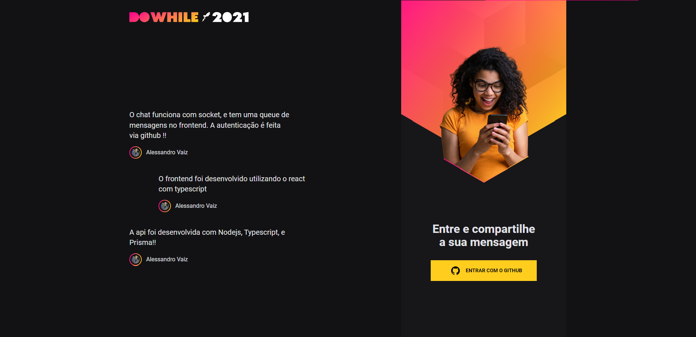
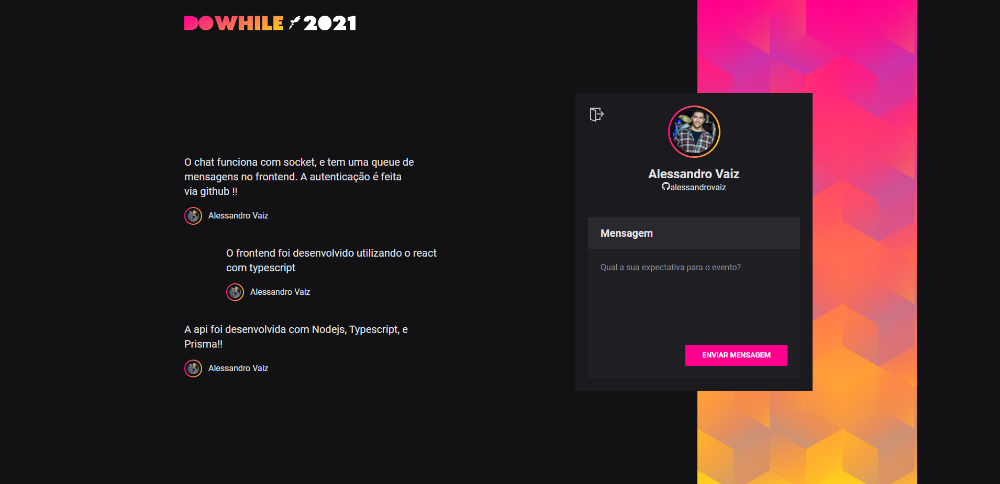

<h1 align="center">
  NLW HEAT
</h1>
<h3 align="center">
	NLW: Next Level Week ( Nodejs + TypeScript + Prisma ORM + Socket.io + React)
</h3>

---
## 💻 Sobre o projeto

É uma aplicação que permite você se autenticar com o GitHub e utilizar um chat.
Projeto desenvolvido durante a **Next Level Week Heat** oferecida pela [Rocketseat](https://nextlevelweek.com/)

---
## ⚙️ Funcionalidades

- [x] Autenticar com o github
- [x] Mandar mensagens em tempo real
---

## 🎨 Layout
### Web

<p align="center" style="display: flex; align-items: flex-start; justify-content: center; margin-top: 10px;">
  
</p>

<p align="center" style="display: flex; align-items: flex-start; justify-content: center;">
  
</p>


---

## 🚀 Como executar o projeto

### Pré-requisitos

Antes de começar, você vai precisar ter instalado em sua máquina as seguintes ferramentas:
[Git](https://git-scm.com), [Node.js](https://nodejs.org/en/).
Além disto é bom ter um editor para trabalhar com o código como [VSCode](https://code.visualstudio.com/)

#### 🧭 Rodando a aplicação

```bash

# Clone este repositório
$ git clone https://github.com/alessandrovaiz/nlw_heat.git

#### API
# Acesse a pasta raíz do projeto e abra o seu terminal/cmd
$ cd backend

# Instale as dependências (escolha um)
$ npm install
$ yarn install

#Execute as migrations do prisma
npx prisma migrate dev

# Execute a aplicação em modo de desenvolvimento (escolha um)
$ npm run dev
$ yarn dev

# A API estará rodando na porta:4000

#### FRONTEND
# Acesse a pasta raíz do projeto e abra o seu terminal/cmd
$ cd frontend

# Instale as dependências (escolha um)
$ npm install
$ yarn install

# Execute a aplicação em modo de desenvolvimento (escolha um)
$ npm run dev
$ yarn dev

# O frontend estará rodando na porta:3000
```

---

## 🛠 Tecnologias

As seguintes ferramentas foram usadas na construção do projeto:

#### ( Nodejs + TypeScript + Prisma ORM + Socket.io + React )
<br>

---

## 🦸 Autor
<a href="https://github.com/alessandrovaiz">
 
 <br />
 <sub><b>Alessandro Vaiz</b></sub>
</a>
<br />

[](https://www.linkedin.com/in/alessandrovaiz/)
